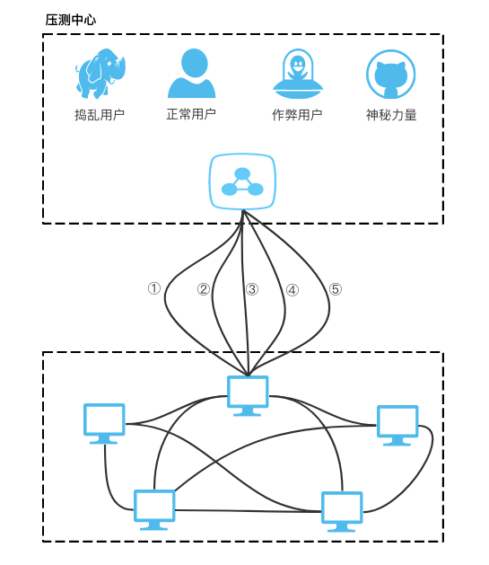
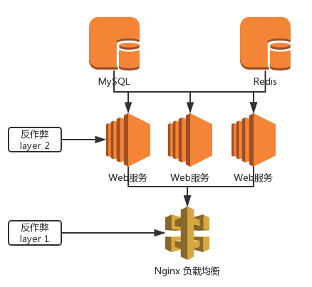
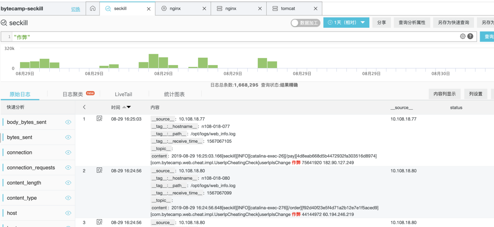
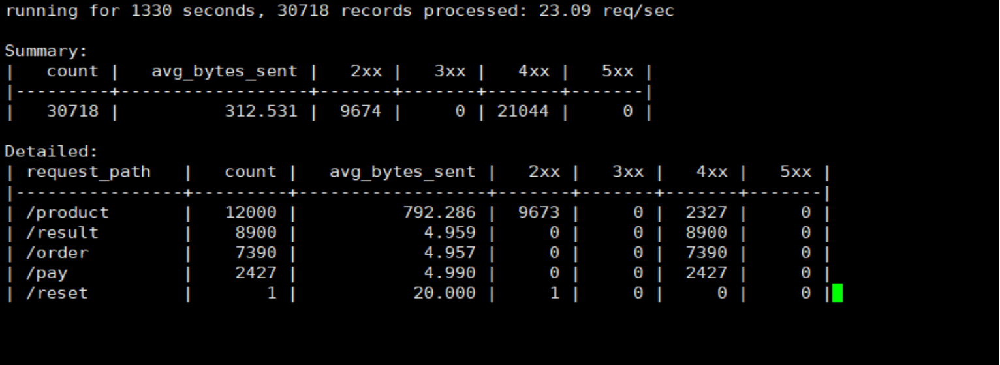
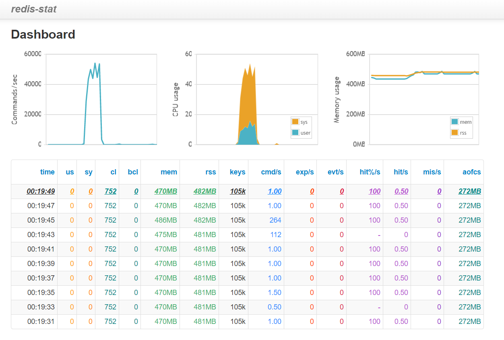
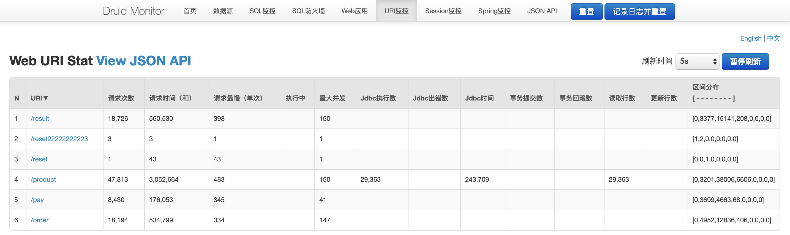
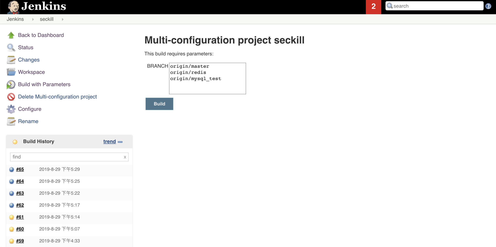
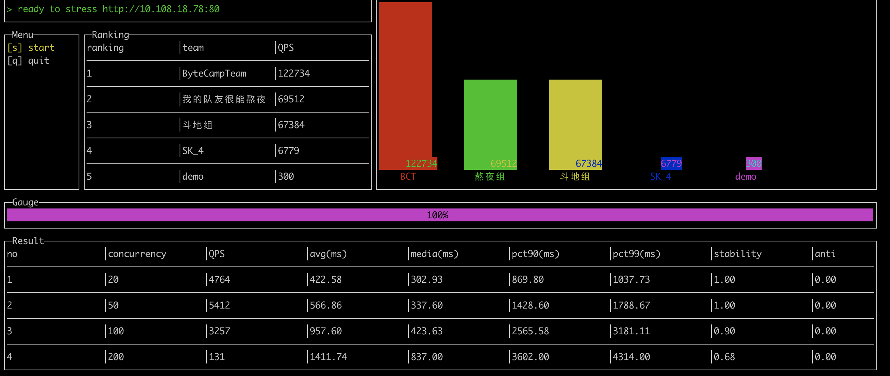

# 高并发高可用秒杀系统设计与实现

## 项目背景

- 5 台 2 核 CPU 8 G 内存机器
- 所有接口以 1s 超时作为压测基线
- 6000 万商品数据
- 500 万正常用户
- 恶意流量直接返回 403



| **接口** | **功能描述**             |
| -------- | ------------------------ |
| /product | 通过商品 ID 查询商品信息 |
| /order   | 下单接口返回订单号       |
| /pay     | 支付订单                 |
| /result  | 查询全部订单             |
| /reset   | 多轮压测间               |

## 整体架构



- 服务器1：MySQL
- 服务器2：Nginx, Tomcat
- 服务器3：Tomcat
- 服务器4：Tomcat
- 服务器5：Redis

## 技术挑战

- 服务需要支持横向扩容
- 并发资源争夺：超卖，少卖
- 服务器并发性能调优
- 反作弊防捣乱策略
- 系统，缓存预热机制
- ......

## 具体方案

### Product

- 缓存：使用 Redis 缓存
- 预热：提前将 400 万数据装入 Redis 中，提高缓存命中率
- 缓存淘汰策略：选择了 LFU 策略

### Order

- 方案一 (master 分支)
  - 通过 MQ 异步下单，订单存储至数据库中
  - MQ 异常、MySQL 异常需要回滚库存
  - 支付与下单间隔时间短时订单未入库：缓存订单信息
- 方案二 (redis 分支)
  - 订单数据存储在 Redis 中
- 优化：售罄商品信息保存在内存中
- 订单号生成算法：时间戳，机器id，商品id

- 防止超卖

  - 超卖原因
    - 对单个用户超卖：同用户对同商品连续发出多个请求，成功重复下单
    - 对所有用户超卖：不同用户对同一商品发出请求，将库存减为负数
  - 解决方案
    - 使用 Redis 原子操作以 uid 与 pid 的组合为键值设置键值对，解决同用户同商品同时下单问题
    - 使用 Redis 的 DECR 方法，进行商品库存的原子性减 1 操作，小于 0 则判断为售罄

- 防止少卖

  - 少卖原因 
    - 方案一中MQ 异常、MySQL 异常需要回滚库存
  - 解决方案
    - 使用 Redis + LUA 脚本来实现原子性操作
    - 库存小于 0 设定为 1
    - 库存大于 0 INCR

### 反作弊策略 Layer 1

Nginx 层配置

- 针对 IP 限制单位时间访问频率和并发限制

- 空 IP、UA 为空或 Spider ，直接返回 403

- 非 GET 或 POST 方式请求，直接返回 403

- ```bash 
  Limit_req_zone  rate 3r/s   		限制同一ip每秒请求不能超过3次
  Limit_conn_zone 10           	限制同一ip与Nginx的连接不超过10
  Limit_rate 500k	              		限制连接的带宽为500k
  ```

###  反作弊策略 Layer 2

Web 服务层实现

- 黑名单机制：相同 uid 对应 ip 发生变化
- 请求链路检查：未查询商品直接下单
- 检查参数是否合法
  - 请求的接口不存在
  - POST 请求没有请求内容
  - Session 为空、Session 不存在或者 Session 与 用户 uid 不匹配
  - 各种参数的范围和格式（如用户 id、商品 id、商品 price、订单号格式）检查

## 性能监控

### 集群日志收集



### Nginx (ngxtop)

[配置](./tree/redis//web/src/main/resources/nginx/)



### Redis



### MySQL 



### 自动化构建

[配置](./tree/redis//web/src/main/resources/jenkins/)



## 项目测试

- 模块功能自测
- 抢购流程测试
- 并发购买压测
- JMeter 压测
- 压测中心集群压测

## 比赛结果



- ByteCamp 2019 工程赛道三等奖（入营 Top 150 in 6000+，Team top 3 in 16 ）

## 反思

只是从工程化的角度去做，搭了一套 Java 工程，各种 Nginx，Tomcat，连接池性能调优，优化接口，怼代码，后续考虑到预热等优化。没有更为针对性的思考， Mentor 高估了我们...

-6000 万商品数据 53 G，全是汉字，Mentor 的做法是对数据压缩，自己写存储到内存中。

golang 真香吧...

Mentor 们都很负责，优秀，ByteDance NB 啊...

## 开发说明

项目基于 SpringBoot + MyBatis + ActiveMQ + Jeds 技术栈。

分支 Master 为使用队列异步下单的版本，Redis 为订单只保存在 Redis 的版本。

在`web/src/main/resources`目录下复制一份开发配置文件`application-dev.yml.example`，复制后的文件命名为`application-dev.yml`。

修改配置文件中相关配置， 运行 SpringBoot 入口文件 WebApplication 中的 main 方法即可启动服务。

服务启动后访问 `http://127.0.0.1:8080/test` 查看 Hello World！

数据库结构及测试：[database](./tree/redis//web/src/main/resources/database/)

